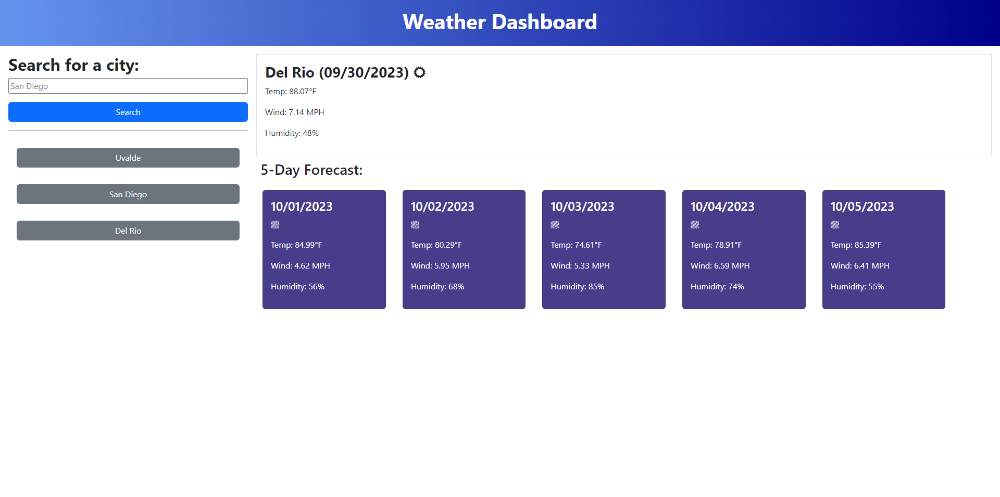

# Weather-Dashboard

## Description

This website is a weather dashboard featuring a search bar and a section to display current weather conditions and 5 days of future
weather forecast, and also a search history of previous cities.

The user can make a search for their city and current weather conditions will display. It contains information about the city's
temperature, wind speed, and humidity level. It will also display the 5 days after the current date and the weather information for
each corresponding date.
When the user makes a search, the city will be saved in it's search history section, where the user can click back and retrieve the
weather information without having to type out the city again.

## Screenshot

## Deployed

https://cazthetraveler.github.io/Weather-Dashboard/