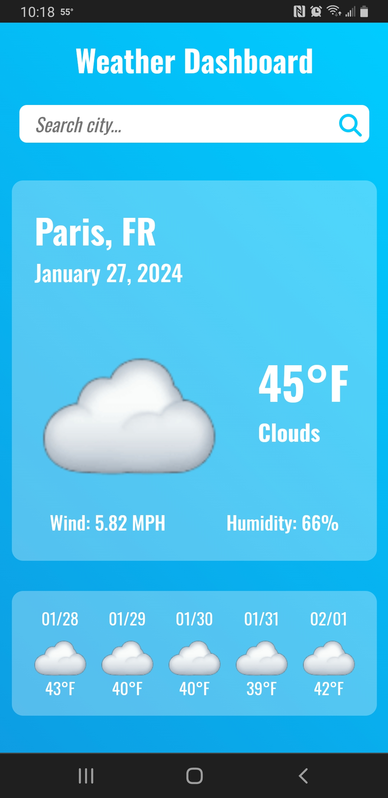
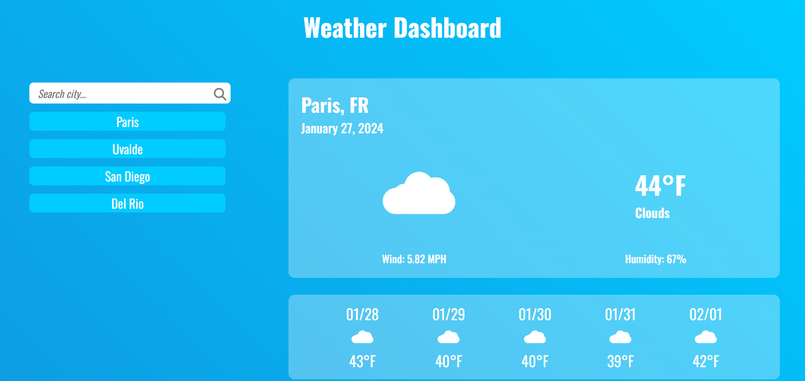

# Weather Dashboard

## Description

This site features a weather dashboard that contains a search bar and sections to display current weather and a five day forecast. The site utilizes the Day.js and OpenWeatherMap APIs.

## Usage

The user can visit the deployed link on GitHub Pages to check the weather in their city or for any other city really. The user can make a search for a valid city around the world. Once they do, the city they entered will be pushed into the search history section, so that the user won't have to type it again to make the search. The search can be made by simply clicking the button. Once a search is made, two sections will fill with data of the current weather conditions, and a five day forecast.

The site is also responsive for mobile and desktop view.

## Screenshot

## Deployed Link

https://cazthetraveler.github.io/Weather-Dashboard/
